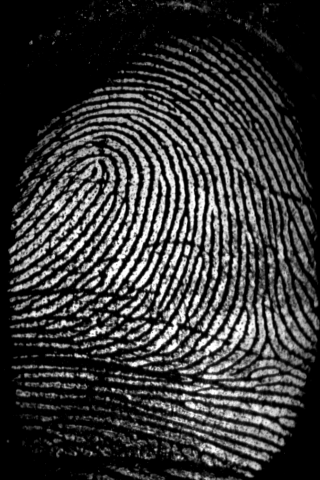

# Why does this repository exist

The fingerprint matching module of [FingerprintRecognitionV2](https://github.com/iluvgirlswithglasses/FingerprintRecognitionV2) is awesome & I'm fucking proud of it. I mean, please look at this set of fingerprint:

Front                                 | Right                                 |
:-----------------------------------: | :-----------------------------------: |
 |  |

They are of a same finger, but each of them is scan from an angle so different to another. Nonetheless, you can grab the front version out (call this *"image [1]"*), then shuffle the right version into a collection of 500 other fingerprints, and then ask [FingerprintRecognitionV2](https://github.com/iluvgirlswithglasses/FingerprintRecognitionV2) this question:

> Out of these 501 images, which is scanned from a same finger as *"image [1]"*?

The repository will reply with this picture:

After **100ms** of pre-processing, **20ms** of comparing 501 pairs of images, and **15ms** of rendering this image.

Guess what? [FingerprintRecognitionV2](https://github.com/iluvgirlswithglasses/FingerprintRecognitionV2) can also perform at such accuracy & performance on terrible images like this:

A pair of nasty quality                | Another pair of nasty quality                |
:------------------------------------: | :------------------------------------------: |
 |  |

You can just suffle one image of each pair into a collection of 500 random fingerprints, and the program can still match the pairs together in a few miliseconds. That's the strength of [FingerprintRecognitionV2](https://github.com/iluvgirlswithglasses/FingerprintRecognitionV2)—It can work well with limited information. However, that's not what businesses want. For example, if you want your fingerprints recorded in a bank's database, the bank gonna scan your fingerprints multiple times, in multiple angles, therefore the requirement for the program to work in limited conditions is no longer needed because the bank already has all the necessary data. They ain't gonna ask the program to find a match for a left fingerprint when the database only has an image of the right version. 

Thus, the awesome accuracy is not really as important as authenticity and performance. That's why this repository exists alongside [FingerprintRecognitionV2](https://github.com/iluvgirlswithglasses/FingerprintRecognitionV2); they co-exist to offer what the other lacks.
